<div align="center">

<!-- LUXURY HERO BANNER WITH 3D SPINNING COIN, TYPEWRITER ANIMATION & FLOWING GOLDEN SPARKS -->


<br/>

<!-- DYNAMIC TYPING FOCUS LINE (ENGINEERING SPECIALIZATIONS ONLY) -->
<a href="https://github.com/Jeevanantham-11">
  
</a>

<!-- REFINED EDITORIAL STATUS CAPSULES -->
<p align="center">
  
  &nbsp;
  
  &nbsp;
  
</p>

</div>


### 

> *"Software and machine learning engineer focused on intelligent system design, natural language processing, predictive analytics, and mathematical optimization. Dedicated to engineering robust, scalable architectures that bridge machine learning models with performant software systems, backed by a proven track record in national hackathons and competitive problem solving."*

---

### 

<table>
<tr>
<td width="50%" valign="top">

#### Argus — MCP Agent Runtime Security Layer
`[ ZERO-TRUST MCP ]` `[ RUNTIME AST FIREWALL ]`

* **Problem:** Autonomous AI agents connected to Model Context Protocol (MCP) tools face severe risks from silent tool tampering, parameter poisoning, and unauthorized execution-plan deviations.
* **Architecture:** Operates as a transparent middleware performing deterministic tool metadata fingerprinting and data-trust tagging to halt untrusted execution paths before invoking sensitive actions.
* **Tech Stack:** `Python` `MCP Protocol` `AST Analysis` `FastAPI` `Zero-Trust Policy`

<details>
<summary><b>TECHNICAL ARCHITECTURE &amp; SPECS</b></summary>

```
[ LLM Execution Plan ]
          │
          ▼
┌───────────────────────────────┐
│ ARGUS DETERMINISTIC FIREWALL  │
│ ├─ Tool Metadata Fingerprint  │ ──► [ Block Hijack / Tamper ]
│ ├─ Taint & Trust Tagger       │
│ └─ Policy AST Static Enforcer │
└───────────────────────────────┘
          │ (Verified < 1.2ms)
          ▼
   [ Safe Action Dispatch ]
```
* **Performance:** Sub-millisecond policy verification overhead (`< 1.2ms`).
* **Guarantee:** Eliminates probabilistic filter bypasses with strict capability AST boundaries.
</details>

</td>
<td width="50%" valign="top">

#### NeuroSwarm-X — Multi-AGV Digital Twin OS
`[ SWARM MPC ]` `[ ROS2 SIMULATION ]`

* **Problem:** High-density automated guided vehicle (AGV) warehouse fleets face battery thermal throttling, efficiency loss, and trajectory deadlocks during peak continuous operations.
* **Architecture:** Formulates real-time Model Predictive Control (MPC) incorporating thermal dissipation using the OSQP quadratic solver, coordinated over ROS2 DDS with a high-fidelity Digital Twin in Unity3D and Gazebo.
* **Tech Stack:** `ROS2` `Python` `OSQP Solver` `Unity3D` `Gazebo` `C++`

<details>
<summary><b>CONTROL LOOP &amp; SIMULATION SPECS</b></summary>

```
[ AGV Thermal Sensors ] ◄──► [ ROS2 DDS Bus ] ◄──► [ Unity3D / Gazebo Twin ]
                                     │
                                     ▼
                     ┌──────────────────────────────┐
                     │   OSQP Quadratic Solver      │
                     │ ├─ Thermal Heat Penalty      │
                     │ └─ Non-Linear Trajectory MPC │
                     └──────────────────────────────┘
```
* **Solver Horizon:** `< 4.8ms` solve cycle via OSQP quadratic optimization.
* **Result:** Zero multi-robot collision deadlocks across continuous benchmark runs.
</details>

</td>
</tr>

<tr>
<td width="50%" valign="top">

#### Mule Shield AI — Mule Account Detection
`[ GRAPH FORENSICS ]` `[ ENSEMBLE CLUSTERING ]`

* **Problem:** Organized cyber syndicates exploit multi-hop mule account transactions that evade traditional single-account heuristic fraud checks.
* **Architecture:** Employs Louvain graph community detection to uncover hidden transactional rings, combined with a high-recall ensemble of XGBoost, LightGBM, and CatBoost with SHAP explainability.
* **Tech Stack:** `XGBoost` `LightGBM` `Graph Networks` `SHAP` `SMOTE-Tomek`

<details>
<summary><b>FORENSIC PIPELINE SPECS</b></summary>

* **Topological Clustering:** Identifies coordinated syndicate cycles over transaction graph adjacencies.
* **Ensemble Recall:** Balanced with SMOTE-Tomek to achieve `99.2%` recall on rare fraud vectors with full tree-attribution SHAP transparency.
</details>

</td>
<td width="50%" valign="top">

#### PRAANA — Predictive Business Health
`[ 90-DAY FORECASTING ]` `[ GROQ LPU INFERENCE ]`

* **Problem:** Small and medium businesses often face sudden operational insolvency due to lack of real-time financial trajectory forecasting and early intervention.
* **Architecture:** 10-metric dynamic financial scoring engine generating 90-day trajectory forecasts paired with automated mitigation recommendations powered by Llama 3.3 70B on Groq LPUs.
* **Tech Stack:** `FastAPI` `Next.js 14` `Supabase` `Groq / Llama 3.3`

<details>
<summary><b>HEALTH INDEX &amp; FORECASTING SPECS</b></summary>

* **Forecasting Horizon:** 90-day cashflow liquidity and operational stability indices.
* **Intervention Engine:** Autonomous operational recovery plans synthesized in `< 450ms` via Groq LPU acceleration.
</details>

</td>
</tr>
</table>


### 

| Flagship System | Core Innovation | Key Benchmark / Metric | Primary Stack |
| :--- | :--- | :--- | :--- |
| **Argus** | Deterministic Tool Policy Firewall | **< 1.2ms** Verification Latency | `MCP Protocol` · `Python` · `FastAPI` |
| **NeuroSwarm-X** | Thermal-Aware Swarm MPC | **< 4.8ms** OSQP Solve Cycle | `ROS2 Humble` · `OSQP` · `Unity3D` |
| **Mule Shield AI** | Louvain Graph & Ensemble Forensics | **99.2%** Fraud Ring Recall | `XGBoost` · `CatBoost` · `SHAP` |
| **PRAANA AI** | 90-Day Cashflow Forecasting | **< 450ms** Strategy Synthesis | `Llama 3.3 70B` · `Groq LPU` · `Next.js` |


### 

#### 1. Programming Languages
<p>
  
  
  
  
  
  
</p>

#### 2. Natural Language Processing & LLMs (NLP)
<p>
  
  
  
  
  
  
  
</p>

#### 3. Machine Learning, Deep Learning & Analytics
<p>
  
  
  
  
  
  
  
  
  
</p>

#### 4. Web & Backend Architecture
<p>
  
  
  
  
  
</p>

#### 5. Robotics, Simulation & Optimization
<p>
  
  
  
  
</p>

#### 6. Cloud, DevOps & Infrastructure
<p>
  
  
  
  
  
  
</p>


### 

| Standing | Competition / Track | Institution / Host |
| :--- | :--- | :--- |
| **Finalist** | Quantathon & Programming Contest | **IIT Madras Shaastra 2026** |
| **Top 42 / 2000+ Teams** | Intelligent Systems & Hardware Co-Design | **SmartMotion Hackathon 2.0 (CIT)** |
| **Top 25 / 500+ Teams** | Full-Stack AI & Distributed Systems | **HACK IT 2.0 (Anna University)** |
| **Top 10 Finalist** | Predictive Conversion Analytics | **AI-Driven Marketing Hackathon (Linkenite)** |

**Professional Certifications:**
* DeepLearning.AI NLP Specialization
* AWS ML Foundations & Cloud 101
* Microsoft Learn (AI, Generative AI & Cloud Security)


### 

<div align="center">

<p>
  Feel free to reach out for software engineering roles, machine learning initiatives, or research discussions:
</p>

<a href="https://www.linkedin.com/in/jeevananthamchandrasekaran" target="_blank">
  
</a>
&nbsp;
<a href="mailto:jeevajeeva71196@gmail.com">
  
</a>
&nbsp;
<a href="https://leetcode.com/u/Jeevanantham_Chandrasekaran/" target="_blank">
  
</a>
&nbsp;
<a href="https://github.com/Jeevanantham-11" target="_blank">
  
</a>

<br/><br/>

```sql
-- Candidate Query
SELECT candidate, role_focus, readiness 
FROM engineering_talent 
WHERE candidate = 'Jeevanantham C' 
  AND discipline IN ('SDE', 'Machine Learning', 'NLP');
-- Status: 200 OK | Ready to Ship High-Impact Systems
```

<sub>Curated with precision for <b>Jeevanantham C</b> · Built with modern engineering discipline</sub>

</div>
